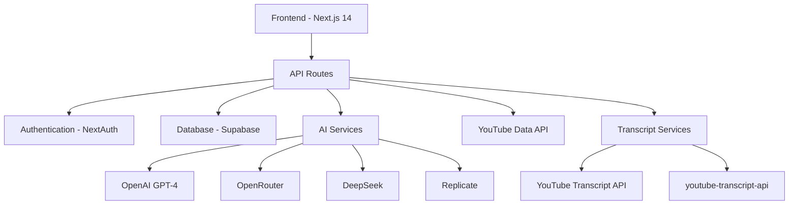

# ResumYT - AI-Powered YouTube Video Summarization Platform

[](https://nextjs.org/)
[](https://www.typescriptlang.org/)
[](https://supabase.com/)
[](https://tailwindcss.com/)

A modern web application that transforms YouTube videos into concise, intelligent summaries using advanced AI technology. Built with Next.js 14, TypeScript, and multiple AI providers for optimal performance and reliability.

## ✨ Features

### 🎥 **Smart Video Processing**
- Automatic YouTube video transcription using multiple fallback methods
- Support for videos in multiple languages
- Intelligent transcript cleanup and preprocessing
- Real-time processing progress tracking

### 🤖 **Advanced AI Summarization**
- Multiple AI providers (OpenAI, OpenRouter, DeepSeek, Replicate)
- Customizable summary formats and lengths
- Language-aware summarization preserving original context
- Intelligent key point extraction

### 👥 **User Management**
- Anonymous user sessions with quota tracking
- Google OAuth integration for authenticated users
- Usage analytics and history tracking
- Personalized summary archives

### 🎨 **Modern UI/UX**
- Responsive design optimized for all devices
- Dark/light theme support with smooth transitions
- Interactive animations using Framer Motion
- Accessible components built with Radix UI
- Progressive Web App (PWA) capabilities

### ⚡ **Performance & Reliability**
- Server-side rendering for optimal SEO
- Intelligent caching strategies
- Rate limiting and abuse prevention
- Error boundaries with graceful fallbacks
- Comprehensive monitoring and analytics

## 🏗️ Architecture Overview

### **Technology Stack**



### **Core Components**

#### **Frontend Architecture**
- **Framework**: Next.js 14 with App Router
- **Styling**: Tailwind CSS with custom design system
- **Components**: Radix UI for accessibility and consistency
- **Animations**: Framer Motion for smooth interactions
- **State Management**: React Query for server state, Context for global state

#### **Backend Services**
- **API Layer**: Next.js API routes with TypeScript
- **Database**: Supabase (PostgreSQL) with real-time subscriptions
- **Authentication**: NextAuth.js with Google OAuth
- **File Storage**: Supabase Storage for media assets
- **Caching**: Node-cache for API response optimization

#### **AI Integration**
- **Primary**: OpenAI GPT-4 for high-quality summarization
- **Fallback**: OpenRouter for model diversity and reliability
- **Specialized**: DeepSeek for efficient processing
- **Media**: Replicate for multimedia content analysis

## 🚀 Quick Start

### **Prerequisites**

- Node.js 18+ and npm/yarn
- Supabase account for database
- API keys for AI services (at least one required):
  - OpenAI API key
  - OpenRouter API key
  - DeepSeek API key
  - Replicate API token
- YouTube Data API v3 key
- Google OAuth credentials (optional, for user authentication)

### **Installation**

1. **Clone the repository**
   ```bash
   git clone https://github.com/yourusername/resumyt.git
   cd resumyt
   ```

2. **Install dependencies**
   ```bash
   npm install
   # or
   yarn install
   ```

3. **Environment setup**
   ```bash
   cp .env.example .env
   ```

   Edit `.env` with your actual API keys and configuration:
   ```env
   # Required: At least one AI provider
   OPENAI_API_KEY=your_openai_api_key
   OPENROUTER_API_KEY=your_openrouter_api_key
   DEEPSEEK_API_KEY=your_deepseek_api_key
   REPLICATE_API_TOKEN=your_replicate_token

   # Required: Database
   NEXT_PUBLIC_SUPABASE_URL=your_supabase_url
   NEXT_PUBLIC_SUPABASE_ANON_KEY=your_supabase_anon_key

   # Required: YouTube API
   NEXT_PUBLIC_YOUTUBE_API_KEY=your_youtube_api_key

   # Optional: Authentication
   GOOGLE_CLIENT_ID=your_google_client_id
   GOOGLE_CLIENT_SECRET=your_google_client_secret
   NEXTAUTH_SECRET=your_nextauth_secret
   ```

4. **Database setup**

   Create the required tables in your Supabase database:
   ```sql
   -- Users table
   CREATE TABLE users (
     id UUID DEFAULT gen_random_uuid() PRIMARY KEY,
     email TEXT UNIQUE,
     name TEXT,
     quota_remaining INTEGER DEFAULT 10,
     created_at TIMESTAMP WITH TIME ZONE DEFAULT NOW()
   );

   -- Videos table
   CREATE TABLE videos (
     id SERIAL PRIMARY KEY,
     url TEXT NOT NULL,
     title TEXT,
     thumbnail_url TEXT,
     user_id UUID REFERENCES users(id),
     created_at TIMESTAMP WITH TIME ZONE DEFAULT NOW()
   );

   -- Summaries table
   CREATE TABLE summaries (
     id SERIAL PRIMARY KEY,
     video_id INTEGER REFERENCES videos(id),
     user_id UUID REFERENCES users(id),
     content TEXT NOT NULL,
     transcript TEXT,
     format TEXT DEFAULT 'standard',
     created_at TIMESTAMP WITH TIME ZONE DEFAULT NOW()
   );
   ```

5. **Run the development server**
   ```bash
   npm run dev
   # or
   yarn dev
   ```

6. **Open your browser**
   Navigate to [http://localhost:3000](http://localhost:3000)

## 📁 Project Structure

```
resumyt/
├── src/
│   ├── app/                 # Next.js 14 app directory
│   │   ├── globals.css      # Global styles
│   │   ├── layout.tsx       # Root layout
│   │   ├── page.tsx         # Home page
│   │   └── api/             # API routes
│   │       ├── auth/        # Authentication endpoints
│   │       ├── summarize/   # Video summarization
│   │       └── videos/      # Video management
│   ├── components/          # React components
│   │   ├── ui/              # Reusable UI components
│   │   ├── forms/           # Form components
│   │   ├── layout/          # Layout components
│   │   └── video/           # Video-specific components
│   ├── lib/                 # Utility libraries
│   │   ├── supabase.ts      # Database client
│   │   ├── auth.ts          # Authentication config
│   │   ├── utils.ts         # General utilities
│   │   └── ai/              # AI service integrations
│   ├── hooks/               # Custom React hooks
│   ├── types/               # TypeScript type definitions
│   └── styles/              # Additional styles
├── public/                  # Static assets
├── docs/                    # Documentation
├── .env.example             # Environment template
├── next.config.js           # Next.js configuration
├── tailwind.config.ts       # Tailwind CSS config
└── tsconfig.json           # TypeScript config
```

## 🔧 Configuration

### **AI Provider Configuration**

The application supports multiple AI providers with automatic fallback:

```typescript
// lib/ai/config.ts
export const AI_PROVIDERS = {
  openai: {
    model: "gpt-4o-mini",
    maxTokens: 500,
    temperature: 0.3
  },
  openrouter: {
    model: "openai/gpt-4o-mini",
    maxTokens: 500,
    temperature: 0.3
  },
  deepseek: {
    model: "deepseek-chat",
    maxTokens: 500,
    temperature: 0.3
  }
};
```

### **Rate Limiting**

Configurable rate limits to prevent abuse:

```typescript
// lib/rateLimit.ts
export const RATE_LIMITS = {
  anonymous: {
    requests: 5,
    window: '1h',
    quotaPerDay: 3
  },
  authenticated: {
    requests: 20,
    window: '1h',
    quotaPerDay: 50
  }
};
```

## 🔒 Security Features

### **Data Protection**
- Environment variables for all sensitive data
- API key rotation support
- Input validation and sanitization
- SQL injection prevention
- XSS protection

### **Rate Limiting**
- IP-based request limiting
- User quota management
- Abuse detection and prevention
- Graceful degradation

### **Authentication**
- Secure session management
- OAuth integration
- CSRF protection
- Secure cookie handling

## 🚀 Deployment

### **Vercel (Recommended)**

1. **Deploy to Vercel**
   ```bash
   npm run build
   vercel --prod
   ```

2. **Configure environment variables in Vercel dashboard**

3. **Set up custom domain (optional)**

### **Docker Deployment**

```bash
# Build image
docker build -t resumyt .

# Run container
docker run -p 3000:3000 --env-file .env resumyt
```

### **Manual Deployment**

```bash
# Build for production
npm run build

# Start production server
npm start
```

## 🤝 Contributing

We welcome contributions! Please feel free to submit a Pull Request.

### **Development Workflow**

1. Fork the repository
2. Create a feature branch (`git checkout -b feature/amazing-feature`)
3. Commit your changes (`git commit -m 'Add amazing feature'`)
4. Push to the branch (`git push origin feature/amazing-feature`)
5. Open a Pull Request

### **Code Standards**

- TypeScript for type safety
- ESLint and Prettier for code formatting
- Conventional commits for clear history
- Unit tests for new features
- Documentation updates for API changes

## 📄 License

This project is licensed under the MIT License - see the [LICENSE](LICENSE) file for details.

## 🙏 Acknowledgments

- [Next.js](https://nextjs.org/) for the incredible React framework
- [Supabase](https://supabase.com/) for the backend-as-a-service platform
- [OpenAI](https://openai.com/) for powerful AI models
- [Radix UI](https://www.radix-ui.com/) for accessible component primitives
- [Tailwind CSS](https://tailwindcss.com/) for utility-first styling
- [Framer Motion](https://www.framer.com/motion/) for smooth animations

---

**Built with ❤️ by [Obed Vargas](https://github.com/obedvargasvillarreal)**
